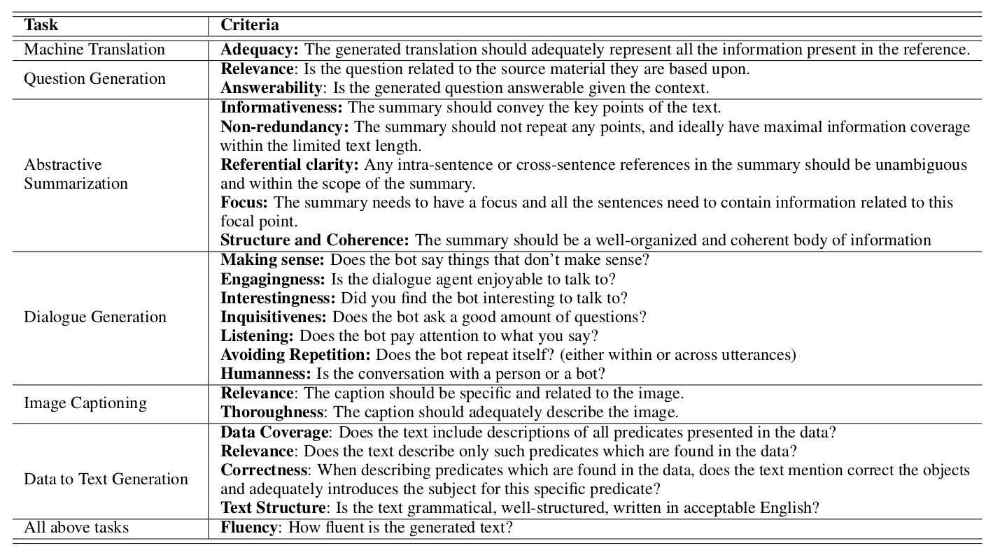
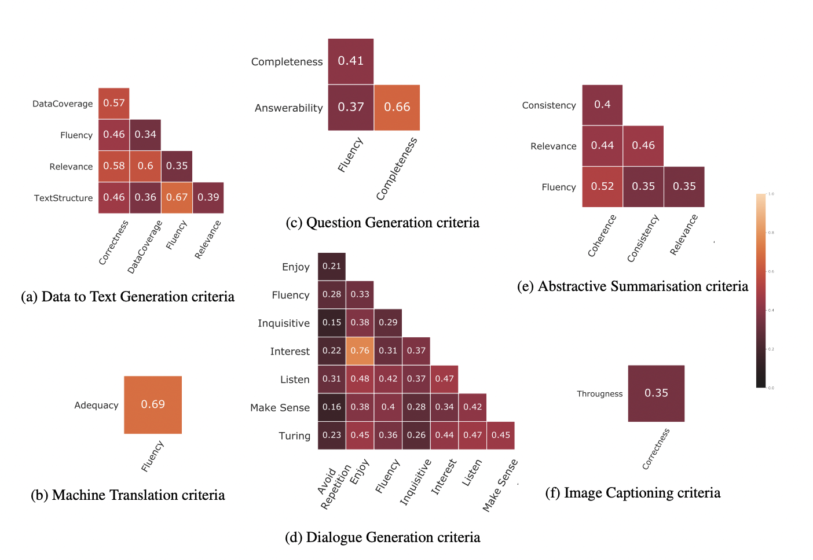
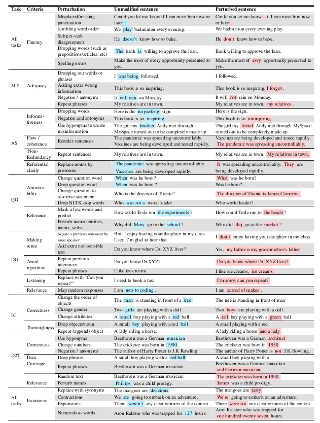
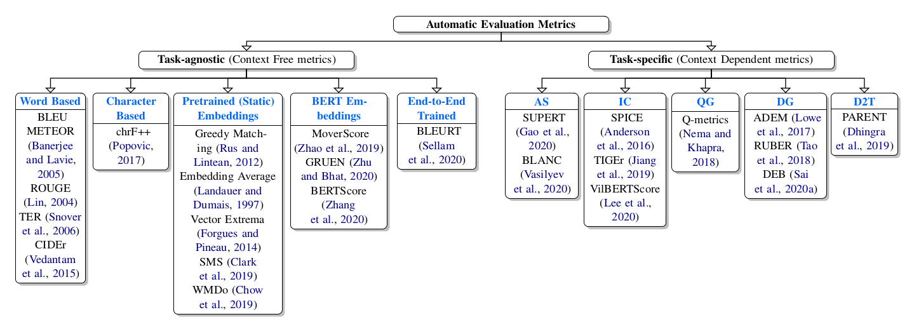
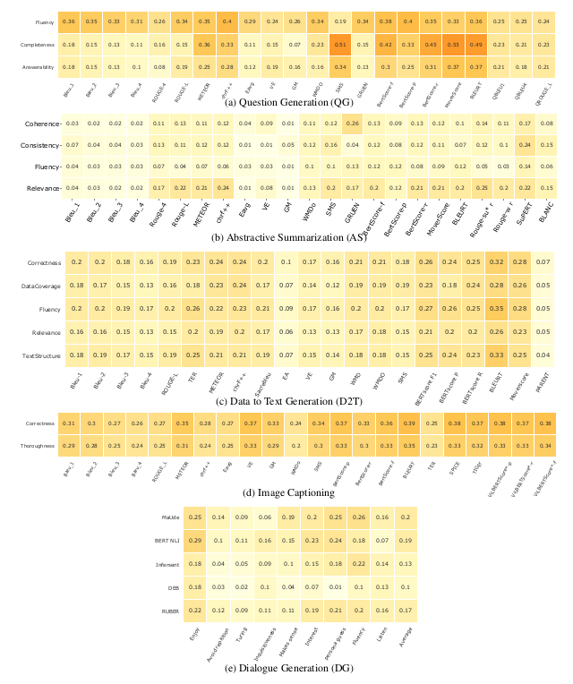
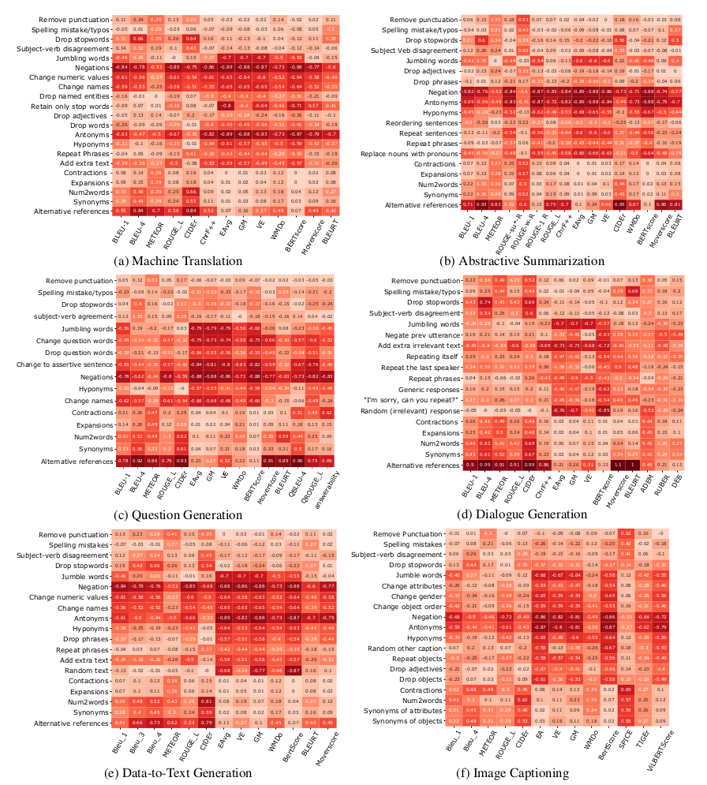

This webpage and repository are complementary to the paper [Perturbation CheckLists for Evaluating NLG Evaluation Metrics](https://arxiv.org/abs/2109.05771) by [Ananya B. Sai](https://ananyasaib.github.io/), [Tanay Dixit](https://tanay2001.github.io/), [Dev Yashpal Sheth](https://www.linkedin.com/in/dev-sheth/), [Sreyas Mohan](https://sreyas-mohan.github.io/) and [Mitesh M. Khapra](https://www.cse.iitm.ac.in/~miteshk/).

## Overview

In this work we provide a detailed analysis of Natural Language Generation (NLG) metrics by going beyond correlation with human scores. We propose a comprehensive criteria-checklist based evaluation that will act as a diagnostic tool in pointing out specific avenues of improvement in metrics. We create specific perturbation templates that are targeted to test the performance of a metric along a particular dimension.

## Human Evaluation Criteria

Each of the 6 NLG tasks below have the following criteria along which they are evaluated. The table can also be found in our paper and has been referred from the following paper, [A Survey of Evaluation Metrics Used for NLG Systems](https://arxiv.org/abs/2008.12009).



## Correlations among various Criteria

It is typically the case that the human criteria for evaluation are not highly correlated with each other. Hence using one automatic evaluation metric to define "overall" performance for a task is not ideal. The heatmaps below indicate the *Kendall Tau* correlation values between various criteria calculated from human judgement scores released as part of each task's publicly available datasets. 



## Perturbation Templates

The following examples illustrate the perturbations created by each template for different NLG tasks and criteria. The idea is to test each evaluate each evaluation metric in detecting criteria-specific changes. 

For example, consider the criteria fluency which is relevant for all the tasks. Now consider a perturbation template for this criteria which simply drops the stop words in the output. Such a perturbation would definitely affect the fluency of the output. If an automatic evaluation metric is capable of assessing fluency, then this drop in the fluency of the output should get reflected in the score assigned by the metric. 

We design a total of 34 such perturbation templates across all the criteria and all the tasks. Each template is manually created by us and targets a specific criteria. We also present invariant templates that do not affect any criteria although they modify the sentences. For perturbations resulting from such invariant templates the score of the metric should not drop.



## Automatic Evaluation Metrics

The automatic evaluation metrics included as part of this study can be found below. For a detailed survey and taxonomy over NLG evaluation metrics checkout this paper, [A Survey of Evaluation Metrics Used for NLG Systems](https://arxiv.org/abs/2008.12009).



## Coarse-grained evaluation.

We first calculate the correlations of different automatic evaluation scores with human judgements. Broadly speaking we make the following observations.

1. Mostly poor correlations of metrics across criteria.
2. Pre-training and/or training often helps.
3. Task-agnostic metrics versus task-specific metrics.



## Fine-grained evaluation.

In order to dig deeper into analysing automatic evaluation metrics, we first perturb ground-truth references from the publicly avaiable datasets as per our templates described above. Then for each perturbation, we asked human evaluators "how much would they lower their score seeing such an anomaly?". Ideally, the automatic evaluation metrics should also correspondingly lower their scores by the same amount. However we find that this is generally not the case. In the below heatmaps we plot the difference between change in human scores and metric scores. The larger this difference is, the worse the metric performs in evaluating that particular perturbation. Based on these plots, we are able to spot the following general trends among automatic evalution metrics which might aid further research in these directions. Please refer to our paper for a detailed discussion.

1. Correlations do not reveal everything.
2. Task-specific nuances are not captured.
3. Different metrics have different skills.



## Human Evaluations

The human annotations collected for the templates can be downloaded from [here](https://drive.google.com/drive/u/0/folders/1Gfk8MqlWkgVDc3_zXfHfG6I196qEu2AT). Please refer our paper for elaborate details on collection of these human judgement scores. 

## Code

The code is publicly available [here](https://github.com/iitmnlp/EvalEval).

## Citation

```
@InProceedings{Sai_2021_EMNLP,
    author = {Sai, Ananya B. and Dixit, Tanay and Sheth, Dev Yashpal and Mohan, Sreyas and Khapra, Mitesh M.},
    title = {Perturbation CheckLists for Evaluating NLG Evaluation Metrics},
    booktitle = {Proceedings of the Conference on Empirical Methods in Natural Language Processing (EMNLP)},
    month = {November},
    year = {2021}
}
```
